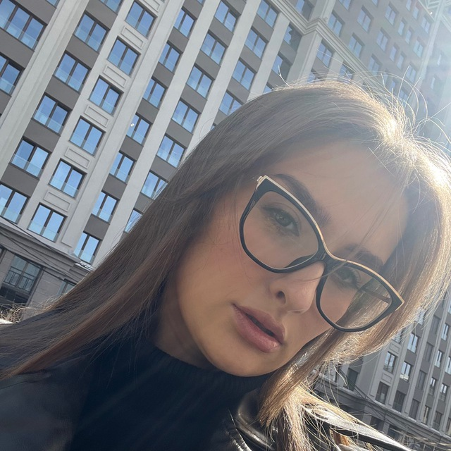

## Привет!

***Меня зовут Вероника, 30 лет, г. Новосибирск***

Уже лет 5 работаю в компании, которая разрабатывает ПО для медицинских организаций.

Занималась всей функциональностью - от регистратуры до патологоанатома. Последние года 2 занимаюсь интеграциями: настраиваю, тестирую,~~ломаю~~, контролирую показатели, ~~оказываю психологическую поддержку сотрудникам медицинских организаций, которые работают с этими интеграциями~~

Учитывая опыт работы, могу поставить вам диагноз не хуже любого поисковика 😅

Сейчас обучаюсь на QA, в частности, очень интересует автоматизация и тестирование безопасности.
Пока не решила, останусь ли после обучения в своей сфере или найду что-то новенькое.

theme: jekyll-theme-hacker
